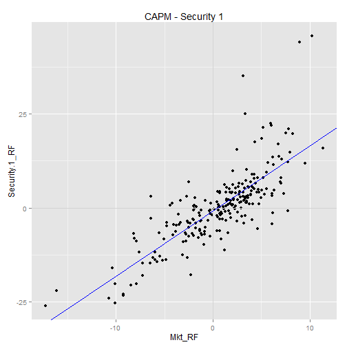
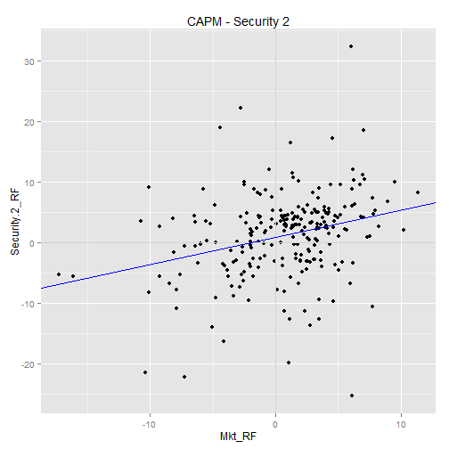
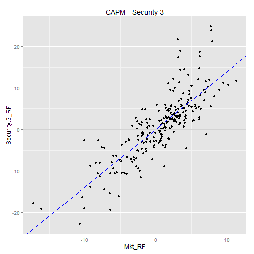

## Fin-Eval: Assignment 3

Rob Alderman  
[Financial Evaluation and Investment Strategy](https://www.coursera.org/learn/investments/outline?module=7TIU9)  
[Assignment 3](https://www.coursera.org/learn/investments/lecture/meglV/assignment-3-analyzing-identifying-three-mystery-securities)  
Sept 2015

<br />
### Data source

[ThreeMysterySecurities.xlsx](ThreeMysterySecurities.xlsx)
from [https://www.coursera.org/learn/investments/supplement/dgfBm/module-2-spreadsheets-and-other-resources](https://www.coursera.org/learn/investments/supplement/dgfBm/module-2-spreadsheets-and-other-resources)  

Source for U.S. Stock Returns and U.S. Treasury Bill Rates: [Kenneth R. French Data Library](http://mba.tuck.dartmouth.edu/pages/faculty/ken.french/data_library.html)  
For defintions of Fama-French Factors (Mkt_RF, SMB, & HML), see [here](http://mba.tuck.dartmouth.edu/pages/faculty/ken.french/Data_Library/f-f_factors.html)  


```r
# Need to set JAVA_HOME and PATH, for read.xlsx
Sys.setenv(JAVA_HOME="C:\\fox\\java\\jre")
p <- Sys.getenv("PATH")
p1 <- paste("C:\\fox\\java\\jre\\bin\\j9vm;", p, sep="")
Sys.setenv(PATH=p1)

library(xlsx)
data <- read.xlsx("ThreeMysterySecurities.xlsx",
                  sheetIndex=1,
                  rowIndex=4:244,
                  colIndex=c(1:5,7:9))
str(data)
```

```
## 'data.frame':	240 obs. of  8 variables:
##  $ date      : num  2e+05 2e+05 2e+05 2e+05 2e+05 ...
##  $ Mkt_RF    : num  1.8 3.63 2.18 2.11 2.9 2.72 3.72 0.55 3.35 -1.52 ...
##  $ SMB       : num  -2.95 -0.33 -0.38 -0.42 -2.25 3.06 2.23 1.83 -2.07 -3.95 ...
##  $ HML       : num  1.64 0.38 -2.05 1.7 1.92 -2.99 -2.24 1.93 -0.95 -0.09 ...
##  $ RF        : num  0.42 0.4 0.46 0.44 0.54 0.47 0.45 0.47 0.43 0.47 ...
##  $ Security.1: num  1.67 3.14 0.38 2.6 2.11 7.05 5.8 1.25 -1.64 -7.42 ...
##  $ Security.2: num  4.59 -1.24 5.91 -4.35 3.92 -0.92 -3.47 4.57 2.89 2.79 ...
##  $ Security.3: num  -1.71 7.74 6.28 6.01 2.26 ...
```

```r
head(data)
```

```
##     date Mkt_RF   SMB   HML   RF Security.1 Security.2 Security.3
## 1 199501   1.80 -2.95  1.64 0.42       1.67       4.59      -1.71
## 2 199502   3.63 -0.33  0.38 0.40       3.14      -1.24       7.74
## 3 199503   2.18 -0.38 -2.05 0.46       0.38       5.91       6.28
## 4 199504   2.11 -0.42  1.70 0.44       2.60      -4.35       6.01
## 5 199505   2.90 -2.25  1.92 0.54       2.11       3.92       2.26
## 6 199506   2.72  3.06 -2.99 0.47       7.05      -0.92      10.45
```

```r
data$Security.1_RF <- data$Security.1 - data$RF
data$Security.2_RF <- data$Security.2 - data$RF
data$Security.3_RF <- data$Security.3 - data$RF
```

<br />
### Question 1

Fill in the table for *Mystery Security #1*.  
What's the identity of the mystery security?  What are its characteristics?


```r
capm.sec1 <- lm(Security.1_RF ~ Mkt_RF, data=data)
summary(capm.sec1)
```

```
## 
## Call:
## lm(formula = Security.1_RF ~ Mkt_RF, data = data)
## 
## Residuals:
##      Min       1Q   Median       3Q      Max 
## -13.9906  -3.2286  -0.6777   2.2818  30.5005 
## 
## Coefficients:
##             Estimate Std. Error t value Pr(>|t|)    
## (Intercept) -0.89703    0.39361  -2.279   0.0236 *  
## Mkt_RF       1.73372    0.08655  20.032   <2e-16 ***
## ---
## Signif. codes:  0 '***' 0.001 '**' 0.01 '*' 0.05 '.' 0.1 ' ' 1
## 
## Residual standard error: 6.029 on 238 degrees of freedom
## Multiple R-squared:  0.6277,	Adjusted R-squared:  0.6261 
## F-statistic: 401.3 on 1 and 238 DF,  p-value: < 2.2e-16
```

```r
fac3.sec1 <- lm(Security.1_RF ~ Mkt_RF + SMB + HML, data=data)
summary(fac3.sec1)
```

```
## 
## Call:
## lm(formula = Security.1_RF ~ Mkt_RF + SMB + HML, data = data)
## 
## Residuals:
##      Min       1Q   Median       3Q      Max 
## -14.0804  -3.4087  -0.8734   2.3941  30.3241 
## 
## Coefficients:
##             Estimate Std. Error t value Pr(>|t|)    
## (Intercept) -0.98466    0.39412  -2.498   0.0132 *  
## Mkt_RF       1.72821    0.09011  19.180   <2e-16 ***
## SMB          0.21753    0.12094   1.799   0.0734 .  
## HML          0.22007    0.12824   1.716   0.0875 .  
## ---
## Signif. codes:  0 '***' 0.001 '**' 0.01 '*' 0.05 '.' 0.1 ' ' 1
## 
## Residual standard error: 5.995 on 236 degrees of freedom
## Multiple R-squared:  0.635,	Adjusted R-squared:  0.6304 
## F-statistic: 136.9 on 3 and 236 DF,  p-value: < 2.2e-16
```

```r
library(ggplot2)
qplot(y=Security.1_RF, x=Mkt_RF, data=data) +
    ggtitle("CAPM - Security 1") + 
    geom_hline(y=0,colour="lightgray") +
    geom_vline(x=0,colour="lightgray") +
    geom_abline(intercept = coef(capm.sec1)["(Intercept)"], 
                slope = coef(capm.sec1)["Mkt_RF"], 
                colour="blue")
```

 


| Security 1                |  Values                                   |
| ---------------------     | ----------------------------------------- |
| Avg return                | 0.5017917                 |
| Avg excess return         | 0.2834167              |
| CAPM alpha                | -0.8970268      |
| CAPM beta                 | 1.7337154           |
| CAPM R<sup>2</sup>        | 0.6276963          |
| 3-factor alpha            | -0.9846608      |
| 3-factor market beta      | 1.728207           |
| 3-factor size beta        | 0.2175268              |
| 3-factor value beta       | 0.2200711              |
| 3-factor R<sup>2</sup>    | 0.6349971          |


Security 1 has beta > 1.  It amplifies market volatility. alpha < 0, so it underperforms w/r/t market volatility.
Its average return is less than that of the market. 
About 63% of volatility is explained by the market.  The 3-factor model didn't improve R<sup>2</sup>.
The coefficients on size and value are small and the market coefficient hardly changed from the CAPM model.
So this security is a mid-cap stock that's very sensitive to market conditions.

Disaster.  Low return combined with high beta.  Underperforms w/r/t volatility (alpha).  It also
underperforms the market in terms of return.  Looks like a mutual fund (mid-high R<sup>2</sup>) focused
on small-cap staocks (slight correlation with size and value).


<br />
### Question 2

Fill in the table for *Mystery Security #2*.  
What's the identity of the mystery security?  What are its characteristics?


```r
capm.sec2 <- lm(Security.2_RF ~ Mkt_RF, data=data)
summary(capm.sec2)
```

```
## 
## Call:
## lm(formula = Security.2_RF ~ Mkt_RF, data = data)
## 
## Residuals:
##     Min      1Q  Median      3Q     Max 
## -28.951  -3.374   0.855   3.018  28.785 
## 
## Coefficients:
##             Estimate Std. Error t value Pr(>|t|)    
## (Intercept)  0.89547    0.43760   2.046   0.0418 *  
## Mkt_RF       0.44628    0.09622   4.638  5.8e-06 ***
## ---
## Signif. codes:  0 '***' 0.001 '**' 0.01 '*' 0.05 '.' 0.1 ' ' 1
## 
## Residual standard error: 6.703 on 238 degrees of freedom
## Multiple R-squared:  0.08289,	Adjusted R-squared:  0.07904 
## F-statistic: 21.51 on 1 and 238 DF,  p-value: 5.805e-06
```

```r
fac3.sec2 <- lm(Security.2_RF ~ Mkt_RF + SMB + HML, data=data)
summary(fac3.sec2)
```

```
## 
## Call:
## lm(formula = Security.2_RF ~ Mkt_RF + SMB + HML, data = data)
## 
## Residuals:
##      Min       1Q   Median       3Q      Max 
## -28.6391  -3.1278   0.5032   3.0448  28.8169 
## 
## Coefficients:
##             Estimate Std. Error t value Pr(>|t|)    
## (Intercept)  0.72909    0.42662   1.709 0.088768 .  
## Mkt_RF       0.55502    0.09754   5.690 3.74e-08 ***
## SMB         -0.11791    0.13091  -0.901 0.368680    
## HML          0.50720    0.13882   3.654 0.000318 ***
## ---
## Signif. codes:  0 '***' 0.001 '**' 0.01 '*' 0.05 '.' 0.1 ' ' 1
## 
## Residual standard error: 6.489 on 236 degrees of freedom
## Multiple R-squared:  0.1476,	Adjusted R-squared:  0.1368 
## F-statistic: 13.62 on 3 and 236 DF,  p-value: 3.158e-08
```

```r
library(ggplot2)
qplot(y=Security.2_RF, x=Mkt_RF, data=data) +
    ggtitle("CAPM - Security 2") + 
    geom_hline(y=0,colour="lightgray") +
    geom_vline(x=0,colour="lightgray") +
    geom_abline(intercept = coef(capm.sec2)["(Intercept)"], 
                slope = coef(capm.sec2)["Mkt_RF"], 
                colour="blue")
```

 


| Security 2                |  Values                                   |
| ---------------------     | ----------------------------------------- |
| Avg return                | 1.4177083                 |
| Avg excess return         | 1.1993333              |
| CAPM alpha                | 0.8954739      |
| CAPM beta                 | 0.4462778           |
| CAPM R<sup>2</sup>        | 0.0828929          |
| 3-factor alpha            | 0.7290924      |
| 3-factor market beta      | 0.5550224           |
| 3-factor size beta        | -0.1179083              |
| 3-factor value beta       | 0.507204              |
| 3-factor R<sup>2</sup>    | 0.1476172          |


Security 2 has excellent returns along with politive alpha and a small beta. 
So it outperforms w/r/t market volatility (alpha > 0).
Its a defensive stock - it correlates with market volatility but in a muted fashion.  
The R<sup>2</sup> is woefully small, so most of the security's volatility is idiosyncratic.
The 3 factor model showed a negative correlation with size and positive correlation with value.
So this appears to be a Large-cap Value stock, necessity good (low beta)

<br />
### Question 3

Fill in the table for *Mystery Security #3*.  
What's the identity of the mystery security?  What are its characteristics?


```r
capm.sec3 <- lm(Security.3_RF ~ Mkt_RF, data=data)
summary(capm.sec3)
```

```
## 
## Call:
## lm(formula = Security.3_RF ~ Mkt_RF, data = data)
## 
## Residuals:
##      Min       1Q   Median       3Q      Max 
## -11.1086  -2.6633  -0.6446   2.0288  17.2719 
## 
## Coefficients:
##             Estimate Std. Error t value Pr(>|t|)    
## (Intercept)  0.01483    0.28834   0.051    0.959    
## Mkt_RF       1.38762    0.06340  21.886   <2e-16 ***
## ---
## Signif. codes:  0 '***' 0.001 '**' 0.01 '*' 0.05 '.' 0.1 ' ' 1
## 
## Residual standard error: 4.417 on 238 degrees of freedom
## Multiple R-squared:  0.6681,	Adjusted R-squared:  0.6667 
## F-statistic:   479 on 1 and 238 DF,  p-value: < 2.2e-16
```

```r
fac3.sec3 <- lm(Security.3_RF ~ Mkt_RF + SMB + HML, data=data)
summary(fac3.sec3)
```

```
## 
## Call:
## lm(formula = Security.3_RF ~ Mkt_RF + SMB + HML, data = data)
## 
## Residuals:
##      Min       1Q   Median       3Q      Max 
## -12.9278  -2.1091  -0.1292   1.8095  12.1429 
## 
## Coefficients:
##             Estimate Std. Error t value Pr(>|t|)    
## (Intercept)  0.33517    0.21563   1.554    0.121    
## Mkt_RF       1.23171    0.04930  24.985   <2e-16 ***
## SMB         -0.01106    0.06617  -0.167    0.867    
## HML         -0.93646    0.07016 -13.347   <2e-16 ***
## ---
## Signif. codes:  0 '***' 0.001 '**' 0.01 '*' 0.05 '.' 0.1 ' ' 1
## 
## Residual standard error: 3.28 on 236 degrees of freedom
## Multiple R-squared:  0.8185,	Adjusted R-squared:  0.8162 
## F-statistic: 354.7 on 3 and 236 DF,  p-value: < 2.2e-16
```

```r
library(ggplot2)
qplot(y=Security.3_RF, x=Mkt_RF, data=data) +
    ggtitle("CAPM - Security 3") + 
    geom_hline(y=0,colour="lightgray") +
    geom_vline(x=0,colour="lightgray") +
    geom_abline(intercept = coef(capm.sec3)["(Intercept)"], 
                slope = coef(capm.sec3)["Mkt_RF"], 
                colour="blue")
```

 


| Security 3                |  Values                                   |
| ---------------------     | ----------------------------------------- |
| Avg return                | 1.178                 |
| Avg excess return         | 0.959625              |
| CAPM alpha                | 0.0148295      |
| CAPM beta                 | 1.3876195           |
| CAPM R<sup>2</sup>        | 0.6680658          |
| 3-factor alpha            | 0.3351697      |
| 3-factor market beta      | 1.231705           |
| 3-factor size beta        | -0.0110649              |
| 3-factor value beta       | -0.9364567              |
| 3-factor R<sup>2</sup>    | 0.8184797          |


Performing at its CAPM benchmark (alpha = 0).  
Highly correlated with growth stocks.
High R<sup>2</sup> in 3-factor model.
Looks like an actively managed mutual fund of tech stocks.


<br />
### Question 4
For each mystery security, does it have a small or large amount of idiosyncratic risk?

Security 1:   
CAPM R<sup>2</sup> = 63%   
3-factor R<sup>2</sup> = 63%   

About 37% of security 1's volatility is due to idiosyncratic (asset-specific) risk. 

Security 2:  
CAPM R<sup>2</sup> = 8.3%   
3-factor R<sup>2</sup> = 15%   

About 85-90% of security 2's volatility is due to idiosyncratic (asset-specific) risk. 

Security 3:  
CAPM R<sup>2</sup> = 67%   
3-factor R<sup>2</sup> = 82%   

About 20-30% of security 3's volatility is due to idiosyncratic (asset-specific) risk. 


<br />
### Question 5
For each mystery security, what portfolio combination of US Stock Market and Treasury Bills will
yield the same CAPM BETA? 

CAPM BETA is the correlation between the asset's excess returns and the market's excess returns.
What combination of Mkt + RF yields the same correlation?

$$
\begin{align*}
[(w_1 \cdot Mkt + w_2 \cdot RF) - RF] &= \beta [ Mkt - RF ]
\\\\
(w_1 \cdot Mkt + (1 - w_1) \cdot RF)  &= RF + \beta [ Mkt - RF ]
\\\\
w_1 \cdot Mkt + RF - w_1 \cdot RF  &= RF + \beta \cdot Mkt - \beta \cdot RF
\\\\
w_1 \cdot Mkt - w_1 \cdot RF  &= \beta \cdot Mkt - \beta \cdot RF
\end{align*}
$$

So in a portfolio combining the US Stock Market and Treasury Bills, the weight of US Stock Market
allocation (\(w_1\)) corresponds to the CAPM beta for the portfolio.
